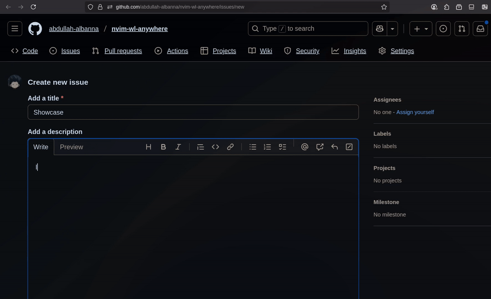

# nvim-hypr-anywhere



Edit text anywhere on **Wayland** using **Neovim**, then paste it into any text field via **wtype**.

Inspired by [vim-anywhere](https://github.com/cknadler/vim-anywhere), but tailored specifically for **Neovim** + **Hyprland**.

---

## Features

- Launch a temporary **Neovim** buffer from anywhere.
- Automatically paste text into the currently focused text field.
- Supports optional file extensions (to get syntax highlighting).

---

## Installation

```bash
git clone https://github.com/abdullah-albanna/nvim-hypr-anywhere.git
cd nvim-hypr-anywhere
chmod +x nvim-hypr-anywhere.sh
```

---

## Usage

Bind the script to a Hyprland key combination.

```bash
bind = SUPER, N, exec, uwsm app -- /path/to/nvim-hypr-anywhere.sh --font-size 25
```

### Command-line Options

- `--ask-ext` → Prompt for a file extension when creating a temporary buffer.
- `--rm-tmp` → Remove the just created temporary file once done with it.
- `--font-size <size>` → Set the terminal font size (default: 25).
- `--term <terminal>` → Choose a terminal emulator (default: alacritty).
- `--term-opts <opts>` → Pass additional terminal options, such as class or flags.

---

## Hyprland Window Rules (Optional)

```bash
windowrulev2 = float, class:nvim-hypr-anywhere
windowrulev2 = pin, class:nvim-hypr-anywhere
windowrulev2 = stayfocused, class:nvim-hypr-anywhere
windowrulev2 = size 70% 70%, class:nvim-hypr-anywhere
```

These rules make the temporary Neovim window float, pin, and stay focused for a better workflow.

---

## Dependencies

Make sure the following commands are installed:

- `nvim` (Neovim)
- `alacritty` (or your chosen terminal)
- `wofi` (for optional extension prompt)
- `wtype` (for pasting text)

```bash
sudo pacman -S neovim alacritty wofi wtype
```

---

## License

MIT
